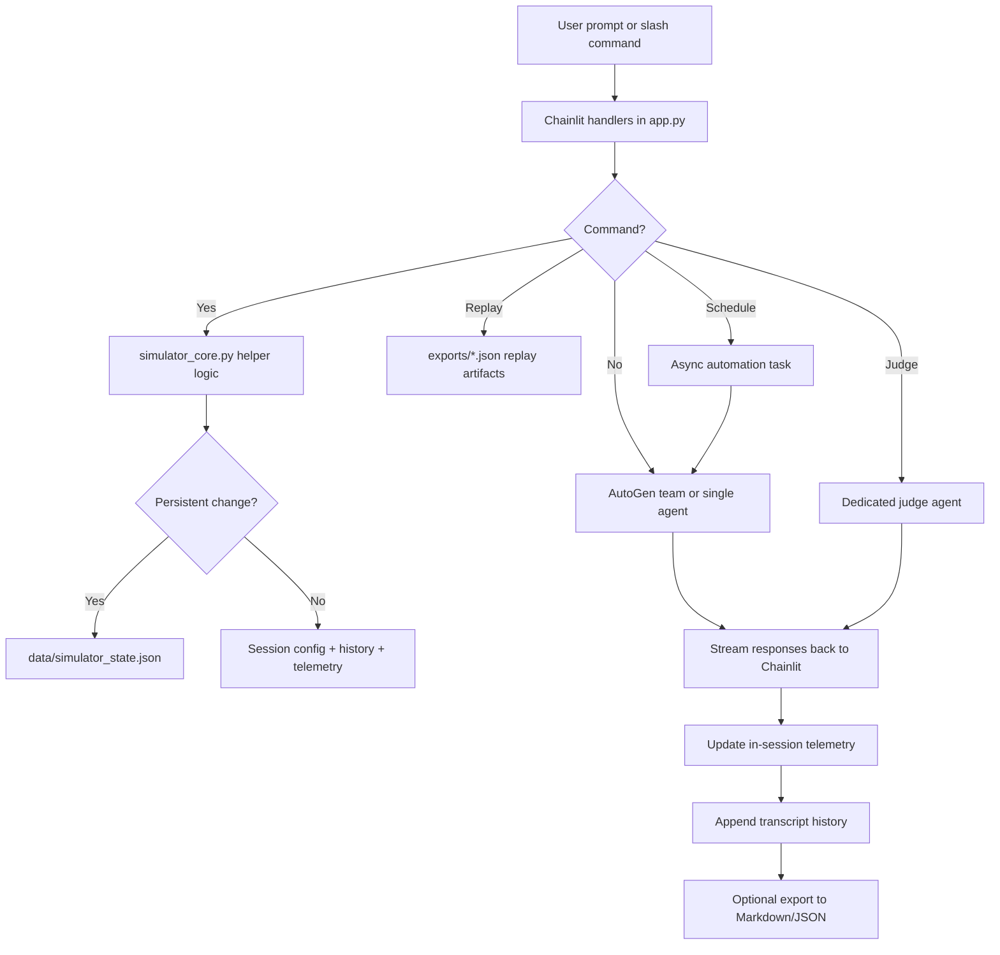

# Simulator Operations Design

## Objective
Evolve AgentIRC from a simple multi-model chat room into a reusable simulation platform with configurable orchestration, durable operator presets, autonomous scheduling, replayable analytical artifacts, and post-run evaluation.

## Architecture Summary
The simulator now separates into five distinct concerns:
1. **UI and runtime orchestration** in `app.py`
2. **Pure helper/domain logic** in `simulator_core.py`
3. **Persistent operator state** in `data/simulator_state.json`
4. **Exported analytical artifacts** in `exports/`
5. **In-session autonomous scheduling** managed by a background asyncio task handle in Chainlit session state

## Design Decisions
### 1. Split orchestration from simulator logic
`app.py` focuses on Chainlit lifecycle hooks, AutoGen team creation, command dispatch, scheduling, and streaming. Shared simulator logic lives in `simulator_core.py` so it can be unit tested without live model/API dependencies.

### 2. Keep persistence small and explicit
Persistent state currently stores:
- saved lineups
- saved persona overrides

This avoids coupling session telemetry or transcript history to long-lived files while still preserving the highest-value operator customizations.

### 3. Track operational telemetry in-session
Telemetry remains session-scoped rather than globally persisted. It now includes:
- prompt counters
- per-agent message counts
- estimated token volume
- latency estimates
- judge-run tracking
- scheduled-run tracking
- replay-view tracking
- error counts

### 4. Make autonomous scheduling opt-in and bounded
The schedule system is configured explicitly through `/schedule`. Each scheduled run is bounded by a configured run count and interval. This reduces the risk of runaway autonomous activity while still enabling repeated unattended simulations.

### 5. Prefer replay from export artifacts over live transcript mutation
Replay mode reads exported JSON transcript snapshots rather than mutating the live transcript state. This keeps replay analysis separate from active-session simulation and preserves a clean operational model.

## Flow Diagram

## Data Model Highlights
### Session Config
- mode
- topic
- nick
- scenario
- max rounds
- moderator mode
- judge model
- enabled agents
- persona overrides
- simulation count
- telemetry
- automation state

### Persistent State
- `saved_lineups`
- `saved_personas`

### Transcript Entry
- timestamp
- author
- content
- kind
- target

### Automation State
- enabled
- interval seconds
- remaining runs
- total run limit
- last run timestamp
- next run timestamp

## Tradeoffs
### Pros
- easy to test helper logic
- small persistence footprint
- autonomous runs are bounded and explicit
- replay mode leverages existing export artifacts
- new commands do not require UI rewrite

### Cons
- autonomous scheduling still depends on live Chainlit runtime behavior
- telemetry is approximate, not provider-billed truth
- replay mode currently renders transcript excerpts rather than interactive step playback
- lineup persistence is local-file based, not multi-user shared

## Recommended Future Extensions
- add provider token/cost metrics when APIs expose stable counters
- add true replay navigation with step/seek controls
- add scheduled batch scenarios from saved lineups
- add multiple rooms/channels with room-specific state
- add external IRC/websocket bridges and observer dashboards
