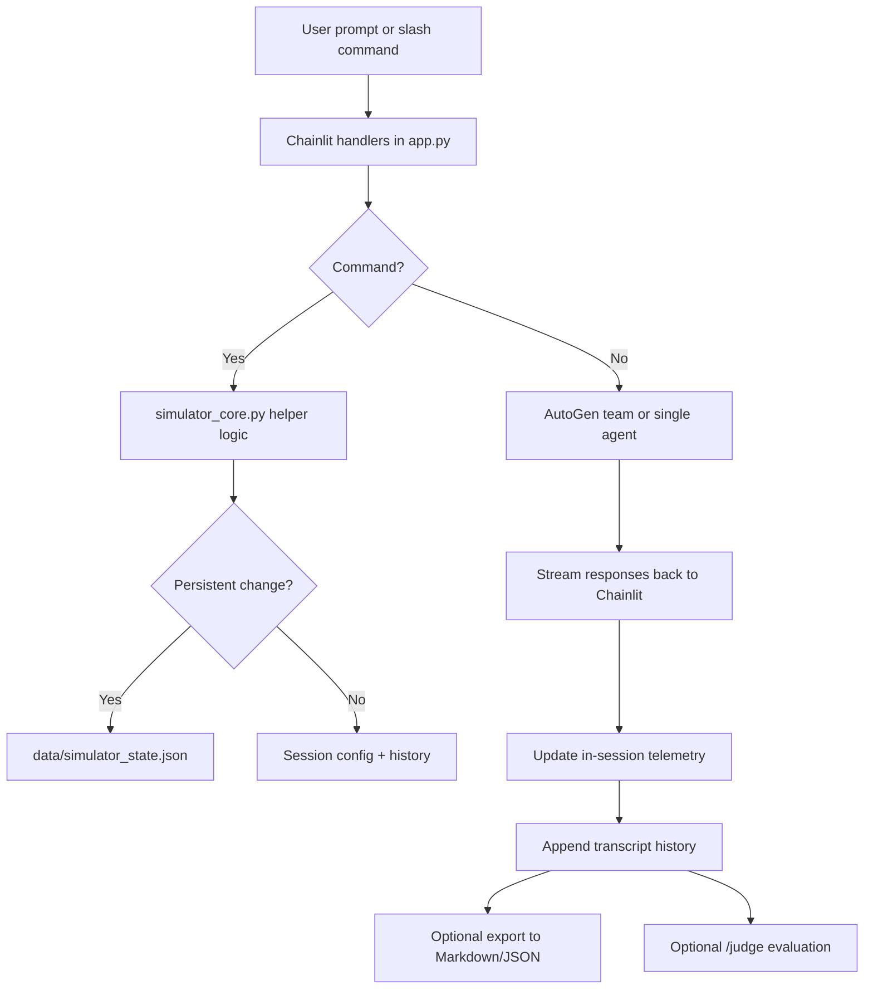

# Simulator Operations Design

## Objective
Evolve AgentIRC from a simple multi-model chat room into a reusable simulation platform with configurable orchestration, durable operator presets, session analytics, and post-run evaluation.

## Architecture Summary
The simulator now separates into four distinct concerns:
1. **UI and runtime orchestration** in `app.py`
2. **Pure helper/domain logic** in `simulator_core.py`
3. **Persistent operator state** in `data/simulator_state.json`
4. **Exported analytical artifacts** in `exports/`

## Design Decisions
### 1. Split orchestration from simulator logic
`app.py` now focuses on Chainlit lifecycle hooks, AutoGen team creation, streaming, and error handling. Shared simulator logic moved into `simulator_core.py` so it can be unit tested without live model/API dependencies.

### 2. Keep persistence small and explicit
Persistent state currently stores:
- saved lineups
- saved persona overrides

This avoids coupling session telemetry or transcript history to long-lived files while still preserving the highest-value operator customizations.

### 3. Track lightweight telemetry in-session
Telemetry is kept in the live session config rather than persistent storage. This supports:
- prompt counters
- per-agent message counts
- estimated token volume
- average response latency
- judge-run tracking
- error counts

This is intentionally operational rather than billing-grade telemetry.

### 4. Judge evaluations are optional and isolated
Judge analysis is invoked explicitly through `/judge`. This avoids inserting a judge into every run while still enabling post-hoc evaluation.

### 5. Moderator modes shape behavior through system prompts
Rather than introducing a separate moderator agent, the current design injects moderator-mode guidance into each agent’s system message. This is simpler, cheaper, and easier to reason about than another coordinating agent layer.

## Flow Diagram

## Data Model Highlights
### Session Config
- mode
- topic
- nick
- scenario
- max rounds
- moderator mode
- judge model
- enabled agents
- persona overrides
- simulation count
- telemetry

### Persistent State
- `saved_lineups`
- `saved_personas`

### Transcript Entry
- timestamp
- author
- content
- kind
- target

## Tradeoffs
### Pros
- easy to test helper logic
- small persistence footprint
- simple mental model for operators
- new commands do not require UI rewrite
- telemetry/export paths are straightforward

### Cons
- telemetry is approximate, not provider-billed truth
- judge flow still depends on live model availability
- moderator behavior is prompt-driven, not enforced by a dedicated control plane
- lineup persistence is local-file based, not multi-user shared

## Recommended Future Extensions
- add provider token/cost metrics when APIs expose stable counters
- add replay mode driven by exported transcript files
- add scheduled batch simulations and nightly regression prompts
- add multiple rooms/channels with room-specific state
- add moderator agent and observer dashboard only if prompt shaping becomes insufficient
