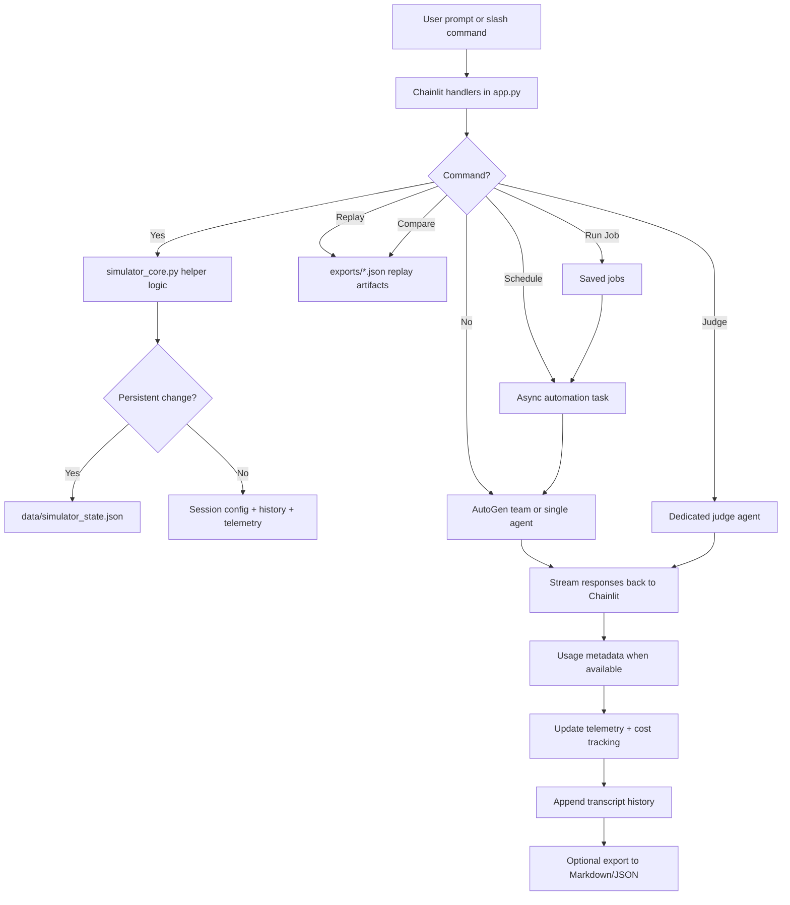

# Simulator Operations Design

## Objective
Evolve AgentIRC from a simple multi-model chat room into a reusable simulation platform with configurable orchestration, durable operator presets, autonomous scheduling, replayable analytical artifacts, hybrid cost tracking, and reusable autonomous jobs.

## Architecture Summary
The simulator now separates into six distinct concerns:
1. **UI and runtime orchestration** in `app.py`
2. **Pure helper/domain logic** in `simulator_core.py`
3. **Persistent operator state** in `data/simulator_state.json`
4. **Exported analytical artifacts** in `exports/`
5. **In-session autonomous scheduling** managed by a background asyncio task handle in Chainlit session state
6. **Hybrid telemetry and cost accounting** derived from provider usage data where available and heuristics otherwise

## Design Decisions
### 1. Split orchestration from simulator logic
`app.py` focuses on Chainlit lifecycle hooks, AutoGen team creation, command dispatch, scheduling, and streaming. Shared simulator logic lives in `simulator_core.py` so it can be unit tested without live model/API dependencies.

### 2. Keep persistence small and explicit
Persistent state currently stores:
- saved lineups
- saved persona overrides
- saved jobs

This avoids coupling session telemetry or transcript history to long-lived files while still preserving the highest-value operator customizations.

### 3. Use hybrid cost tracking instead of pretending heuristics are truth
The simulator now attempts to read model usage metadata from events when available. If provider-native usage is missing, it falls back to estimated token counts based on text length.

This creates a layered model:
- **actual cost** when usage metadata exists and pricing hints are configured
- **estimated cost** otherwise

### 4. Make autonomous scheduling opt-in and bounded
The schedule system is configured explicitly through `/schedule` or `/run-job`. Each scheduled run is bounded by a configured run count and interval. This reduces the risk of runaway autonomous activity while still enabling repeated unattended simulations.

### 5. Prefer replay and comparison from export artifacts over live transcript mutation
Replay mode and comparison mode read exported JSON transcript snapshots rather than mutating the live transcript state. This keeps replay analysis separate from active-session simulation and preserves a clean operational model.

### 6. Persist reusable jobs instead of inventing a job server
Saved jobs are local presets that bundle schedule parameters with simulation state. This captures high-value operator workflows without requiring a full distributed scheduler.

## Flow Diagram

## Data Model Highlights
### Session Config
- mode
- topic
- nick
- scenario
- max rounds
- moderator mode
- judge model
- enabled agents
- persona overrides
- simulation count
- telemetry
- automation state

### Persistent State
- `saved_lineups`
- `saved_personas`
- `saved_jobs`

### Transcript Entry
- timestamp
- author
- content
- kind
- target

### Automation State
- enabled
- interval seconds
- remaining runs
- total run limit
- active job name
- last run timestamp
- next run timestamp

### Per-Agent Telemetry
- messages
- chars
- prompt tokens
- completion tokens
- total tokens
- estimated cost
- actual cost
- usage sample count
- average latency

## Tradeoffs
### Pros
- easy to test helper logic
- small persistence footprint
- autonomous runs are bounded and explicit
- replay/compare mode leverages existing export artifacts
- cost tracking is useful even when only partially backed by provider metadata

### Cons
- autonomous scheduling still depends on live Chainlit runtime behavior
- actual cost depends on provider usage metadata being present
- replay mode currently renders transcript excerpts rather than interactive step playback
- saved jobs are local-file based, not multi-user shared

## Recommended Future Extensions
- add interactive replay navigation with seek/step controls
- add scheduled batch scenarios from saved lineups and saved jobs
- add multiple rooms/channels with room-specific state
- add external IRC/websocket bridges and observer dashboards
- add provider-backed live integration tests behind environment flags
