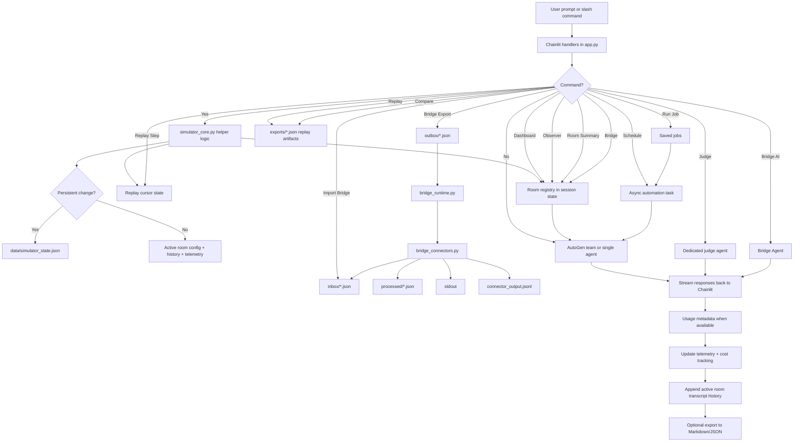

# Simulator Operations Design

## Objective
Evolve AgentIRC from a simple multi-model chat room into a reusable simulation platform with configurable orchestration, durable operator presets, autonomous scheduling, replayable analytical artifacts, hybrid cost tracking, reusable autonomous jobs, room-scoped simulation workflows, operator dashboard tools, cross-room context sharing, external bridge foundations, prompt-interval auto-bridge policies, and persistent room archives.

## Architecture Summary
The simulator now separates into twelve distinct concerns:
1. **UI and runtime orchestration** in `app.py`
2. **Pure helper/domain logic** in `simulator_core.py`
3. **Session room registry** in Chainlit session state
4. **Replay cursor state** in Chainlit session state
5. **Persistent operator state** in `data/simulator_state.json`
6. **Exported analytical artifacts** in `exports/`
7. **External bridge payload outbox/inbox/processed directories**
8. **Standalone bridge runtime scaffold** in `bridge_runtime.py`
9. **Connector adapter layer** in `bridge_connectors.py`
10. **IRC transport scaffold** in `irc_bridge_runtime.py`
11. **Hybrid telemetry and cost accounting** derived from provider usage data where available and heuristics otherwise
12. **Archive and auto-bridge policy helpers** in `simulator_core.py`

## Design Decisions
### 1. Rooms are session-scoped, not globally persisted
Rooms represent alternate simulation contexts inside one live operator session. They keep:
- room-local config
- room-local transcript history

Rooms do **not** persist across full application restarts yet. This keeps the model simple and avoids conflating operator presets with live chat state.

### 2. Replay stepping should be cursor-based, not a separate playback engine
Interactive replay stepping is implemented as a lightweight replay-window cursor held in session state.

This approach:
- reuses existing export artifacts
- avoids introducing a complex playback subsystem
- keeps the model textual and command-driven
- lets operators jump, step, rewind, and inspect replay windows incrementally

### 3. Dashboards should be summary-first, not UI-heavy
The operator dashboard, observer view, and room-summary surfaces are intentionally text-first.

This approach:
- keeps implementation cost low
- fits the IRC/control-console aesthetic
- provides value before a custom visual dashboard exists
- remains easy to test at the helper layer

### 4. Cross-room bridges have two modes: deterministic and model-generated
The simulator supports two bridge styles:
- **deterministic bridge note**: low-cost, predictable context transfer from recent transcript lines
- **model-generated bridge note**: higher-level abstraction using a bridge agent prompt

This dual approach gives operators a practical cost/quality tradeoff.

### 5. External connectors should evolve in layers: payloads, runtime scaffold, connector adapters, transport-specific scaffolds, then live transports
This pass extends the earlier outbox idea by adding:
- `outbox/` for outbound payloads
- `inbox/` for inbound payloads
- `processed/` for consumed payloads
- `bridge_runtime.py` as a standalone polling scaffold
- `bridge_connectors.py` as a connector adapter layer
- `irc_bridge_runtime.py` as a transport-specific IRC scaffold

This layered approach:
- keeps transport concerns decoupled from simulation logic
- makes connector state visible on disk
- creates a stable contract before adding live websocket or IRC network code
- enables multiple runtime delivery strategies without rewriting the runtime loop

### 6. Keep persistence small and explicit
Persistent state currently stores:
- saved lineups
- saved persona overrides
- saved jobs
- saved bridge policies

This preserves high-value reusable operator assets without persisting volatile room histories or live automation state.

### 7. Use hybrid cost tracking instead of pretending heuristics are truth
The simulator attempts to read model usage metadata from events when available. If provider-native usage is missing, it falls back to estimated token counts based on text length.

This creates a layered model:
- **actual cost** when usage metadata exists and pricing hints are configured
- **estimated cost** otherwise

### 8. Make autonomous scheduling opt-in and bounded
The schedule system is configured explicitly through `/schedule` or `/run-job`. Each scheduled run is bounded by a configured run count and interval. This reduces the risk of runaway autonomous activity while still enabling repeated unattended simulations.

### 9. Room switching rebuilds active runtime state
When the operator switches rooms, the app swaps in the selected room’s config and history, then rebuilds the active AutoGen team. This preserves room-local behavior without duplicating long-lived model runtime objects per room.

### 10. External import remains explicit for now
Inbound payloads can be listed and manually imported, but there is no automatic live transport ingestion yet. This keeps the operational model safe and inspectable.

### 11. Auto-bridge policies should remain simple and prompt-count based first
The current auto-bridge design triggers after a configured number of prompts within a room. This avoids tying bridge policy to wall-clock timing or background schedulers too early.

### 12. Room archives should be explicit snapshots before becoming full persistence
Saving and restoring named archives creates a safe persistence layer for room state without implicitly restoring everything on startup.

## Flow Diagram

## Data Model Highlights
### Active Room State
- room name
- room-local config
- room-local history

### Replay Cursor State
- replay file name
- replay payload
- current window start index
- current window size

### External Payload Types
- `room_snapshot`
- `bridge_note`

### Connector Adapters
- `console`
- `inbox`
- `jsonl`

### Session Config
- room name
- mode
- topic
- nick
- scenario
- max rounds
- moderator mode
- judge model
- enabled agents
- persona overrides
- simulation count
- telemetry
- automation state

### Persistent State
- `saved_lineups`
- `saved_personas`
- `saved_jobs`

### Transcript Entry
- timestamp
- author
- content
- kind
- target

### Automation State
- enabled
- interval seconds
- remaining runs
- total run limit
- active job name
- last run timestamp
- next run timestamp

### Saved Bridge Policy
- target room
- interval prompts
- mode (`note` or `ai`)
- role
- focus

### Auto-Bridge State
- enabled
- target room
- interval prompts
- mode (`note` or `ai`)
- role
- focus
- prompts since last bridge

### Per-Agent / Per-Room Telemetry
- messages
- chars
- prompt tokens
- completion tokens
- total tokens
- estimated cost
- actual cost
- usage sample count
- average latency
- bridge events
- bridge ai events
- observer views
- external exports
- external imports

## Tradeoffs
### Pros
- room separation enables parallel what-if contexts inside one session
- replay stepping adds operator control without a heavy playback subsystem
- dashboard and observer commands provide immediate control-tower value
- deterministic and model-generated bridge modes give a useful quality/cost tradeoff
- outbox/inbox/processed directories create a stable connector boundary before live transports are added
- standalone runtime scaffold enables incremental external integration without daemon complexity inside the main app
- connector adapters make future runtime expansion cleaner
- transport-specific scaffolds can be added incrementally without changing the payload contract
- persistence footprint stays small
- autonomous runs are bounded and explicit

### Cons
- rooms are not yet persisted across application restarts
- bridge AI depends on live model availability and cost
- live IRC/websocket transports are still not implemented; only the scaffold and adapter layer exist
- autonomous scheduling still depends on live Chainlit runtime behavior
- actual cost depends on provider usage metadata being present
- replay mode is still textual rather than visual/graphical
- saved jobs are local-file based, not multi-user shared

## Recommended Future Extensions
- add external IRC/websocket bridge runtime on top of the current connector layer
- add richer observer dashboards with live metrics panels
- add role-specific bridge agents and routing policies
- add provider-backed live integration tests behind environment flags
- add persistent archived room snapshots when session-level room history becomes strategically valuable
- add visual dashboard panels if the command-first interface stops being sufficient
